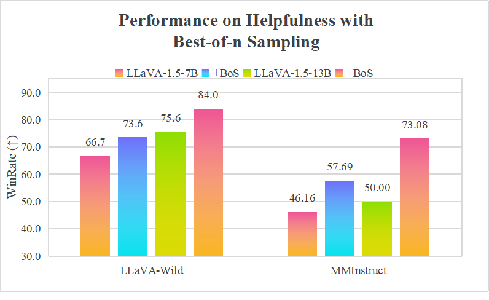
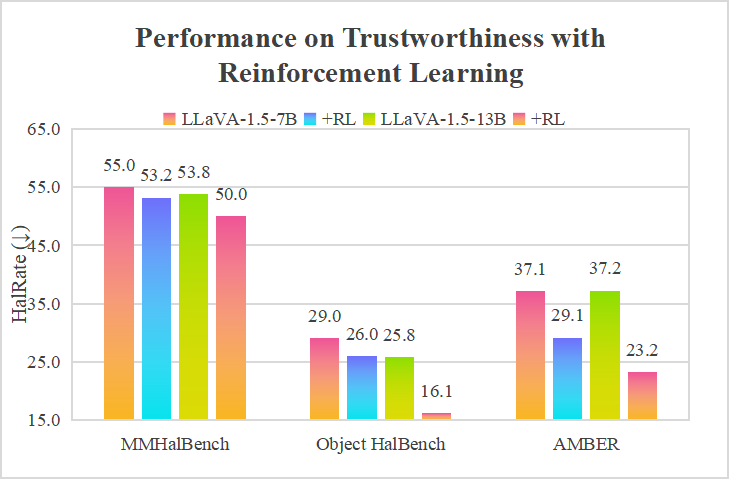
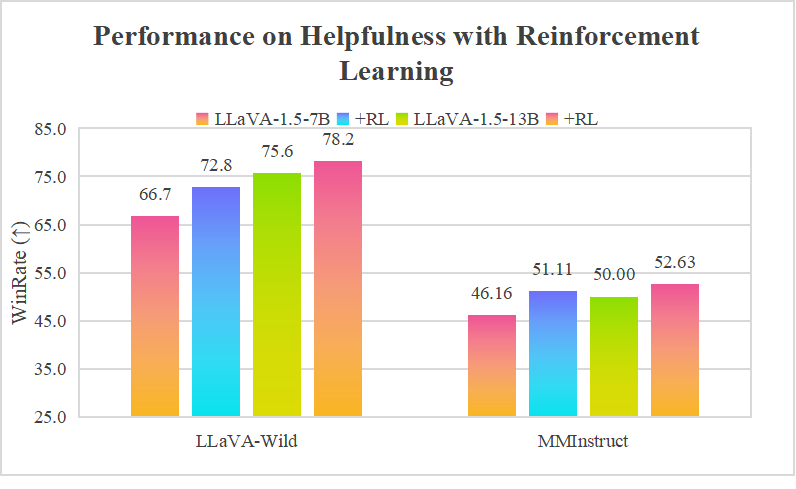
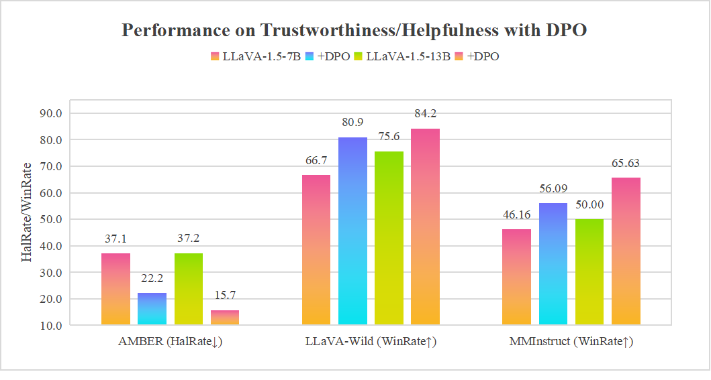

# Vision-LLM Alignemnt Training (SFT+PPO/DPO)
Vision-LLM-Alignment aims to implement alignment training for visual large language models (LLMs), encompassing SFT training, reward model training, and PPO/DPO training. 
For the integration of additional alignment algorithms or to report any arising bugs, please submit an issue.


## Changelog
- [2024/10/03] We support tuning for multi-image instructions on the [LLaMA-3.2-Vision](https://huggingface.co/collections/meta-llama/llama-32-66f448ffc8c32f949b04c8cf). 
See data [examples](data/sft_samples_multi_image.json) for usage.

- [2024/09/28] 💡We support for training the [LLaMA-3.2-Vision](https://huggingface.co/collections/meta-llama/llama-32-66f448ffc8c32f949b04c8cf). You just need to set the `model_architecture` and `template` parameters to "llama-3.2-vision", and specify the LLaMA-Vision model path with `from_checkpoint`.

- [2024/08/21] 💪We released __RoVRM:A Robust Visual Reward Model Optimized via Auxiliary Textual Preference Data__, which is trained and applied for human-alignment training based on this repository.[[Paper](https://arxiv.org/abs/2408.12109)][[Checkpoints](https://huggingface.co/wangclnlp/robust_visual_reward_model)]

- [2024/08/19] We support for training the [LLaVA-NeXT](https://huggingface.co/collections/llava-hf/llava-next-65f75c4afac77fd37dbbe6cf) (as known as LLaVA-1.6). You just need to set the `model_architecture` parameter to "llava_next", and specify the LLaVA-NeXT model path with `from_checkpoint`.

<details><summary>Full Changelog</summary>

- [2024/07/18] We provide a large-scale vision feedback dataset. It is a combination of the following high-quality vision feedback datasets. The dataset can be found in [wangclnlp/vision-feedback-mix-binarized](https://huggingface.co/datasets/wangclnlp/vision-feedback-mix-binarized) and [wangclnlp/vision-feedback-mix-binarized-cleaned](https://huggingface.co/datasets/wangclnlp/vision-feedback-mix-binarized-cleaned).

- [2024/07/10] We support the direct loading of a LLaVA model in all training stages, including SFT training, RM training, and PPO/DPO training.

- [2024/07/07] We support the direct loading of a LLaVA model during the SFT training phase. You just need to set the `model_architecture` parameter to "llava" and specify the LLaVA model path with `from_checkpoint`. Support for this functionality during the DPO, RM training, and PPO junction phases will be introduced soon.
</details>

## Benchmark
During the development of this system, we conducted a series of benchmark tests to evaluate and validate the system's performance. Specifically, we selected RLAIF-V as the preference dataset and LLaVA-Instruct-150K as the input instruction for the RLHF training session. In the model evaluation phase, we utilized several standard benchmarks, including MMHalBench, Object HalBench, AMBER, LLaVA-Benchmark, and MMinstruct, to conduct a more comprehensive assessment of the differences in trustworthiness and helpfulness of the vision-based LLM before and after alignment.

For training the reward model, we used the LLaVA-1.5-7B model. We performed Best-of-n sampling and RLHF (Reinforcement Learning from Human Feedback) alignment training on two models: LLaVA-1.5-7B and LLaVA-1.5-13B, respectively. The benchmarking results of the system are detailed in the figure below.


<details><summary>Full Results</summary>







In addition, we conducted DPO training for this system, specifically targeting the LLaVA-1.5-7B and LLaVA-1.5-13B models. 
The results are detailed in the following figure.



</details>


## Installation
You can use anaconda/miniconda to install packages needed for this project.
```bash
pip install -r requirements.txt
```

## Preparing Models and Datasets
### Models
Vision-LLM requires both a vision encoder and a language model.
Its architecture is depicted in the [figure](https://github.com/microsoft/DeepSpeedExamples/blob/master/applications/DeepSpeed-VisualChat/assets/model.png).
You can also directly employ a vision LLM after SFT, such as LLaVA-1.5/-NeXT and LLaMA-3.2-Vision-Instruction, as the actor model.


### Datasets
We have tentatively implemented all alignment training based on this LLaVA dataset format. 
Some samples can be found in the [data folder](data/).

## Training Models
### Supervised Fine-tuning (SFT)
```Shell
bash run_sft.sh 
```

### Reward Model Training
```Shell
bash run_rm_training.sh
```
### Direct Pereference Optimization (DPO)
```Shell
bash run_dpo_training.sh
```
### Reinforcement Learning from Human Feedback (RLHF)
```Shell
bash run_ppo_training.sh
```
### Evaluation
```Shell
bash run_predict.sh 
```

## Supported Models for Training a Vision-LLM from Scratch.
| LLM | Model size |
|:---:|:---:|
| LLaMA-2 | 7B/13B/70B |
| LLaMA-3 | 8B/70B |

| Vision Projector |
|:---:|
| clip-vit-large-patch14 |
| clip-vit-large-patch14-336 |

## Supported Vision-LLM for Reward Model Training, PPO Training, and DPO Training.
| LLM | Model size |
|:---:|:---:|
| LLaVA | 7B/13B |
| LLaMA-1.5 | 7B/13B |
| LLaMA-NeXT/-1.6-vicuna | 7B/13B |
| LLaMA-NeXT/-1.6-mistral | 7B/13B |
| Llama-3.2-Vision | 11B/90B |

Note: Other LLMs with similar architectures are also supported.
Additionally, custom model architectures can be incorporated by modifying `training/utils/model/build_model.py`(loading model) and `training/utils/data/DST.py`(template).

## Acknowledgement
We commence by utilizing the exceptional codebase provided by [DeepSpeed-VisualChat](https://github.com/microsoft/DeepSpeedExamples/tree/master/applications/DeepSpeed-VisualChat) 🌹🌹🌹.

We would like to thank [Yifu Huo](https://github.com/if-noc) and [Yang Gan](https://github.com/Zhuzhu847) for their contributions to this work.

We thank the following papers:
```bash
[1] Ouyang, Long, et al. "Training language models to follow instructions with human feedback." Advances in neural information processing systems 35 (2022): 27730-27744.
[2] Rafailov, Rafael, et al. "Direct preference optimization: Your language model is secretly a reward model." Advances in Neural Information Processing Systems 36 (2024).
[3] Liu, Haotian, et al. "Visual instruction tuning." Advances in neural information processing systems 36 (2024).
```

Please cite our paper if you find the repo helpful in your work:
```bash
@misc{wang2024rovrmrobustvisualreward,
      title={RoVRM: A Robust Visual Reward Model Optimized via Auxiliary Textual Preference Data}, 
      author={Chenglong Wang and Yang Gan and Yifu Huo and Yongyu Mu and Murun Yang and Qiaozhi He and Tong Xiao and Chunliang Zhang and Tongran Liu and Quan Du and Di Yang and Jingbo Zhu},
      year={2024},
      eprint={2408.12109},
      archivePrefix={arXiv},
      primaryClass={cs.CV},
      url={https://arxiv.org/abs/2408.12109}, 
}
```


